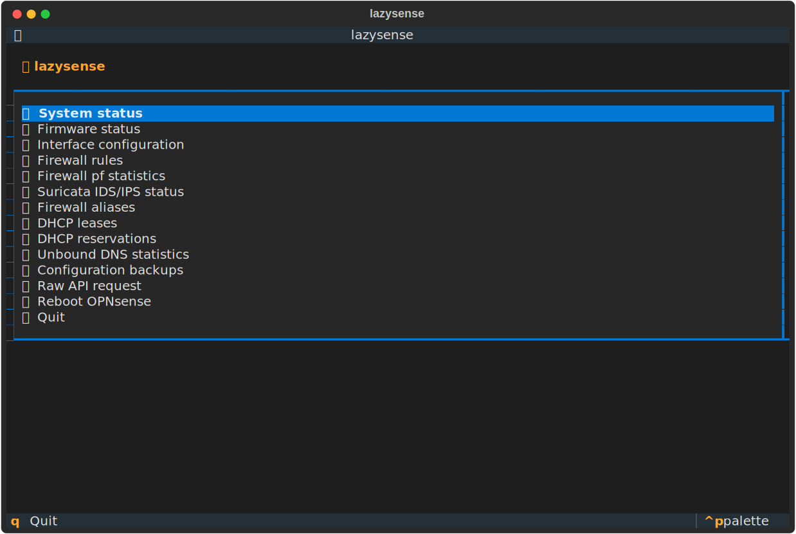
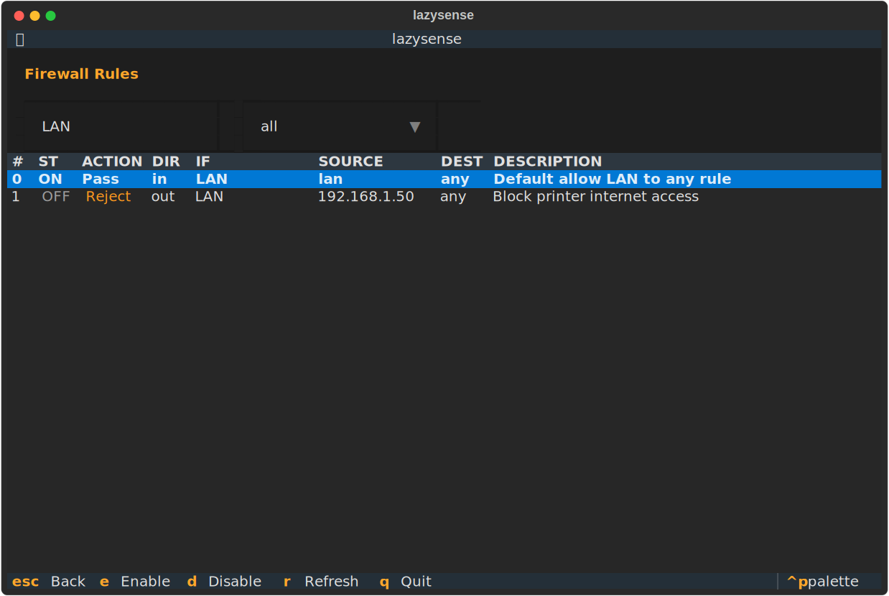
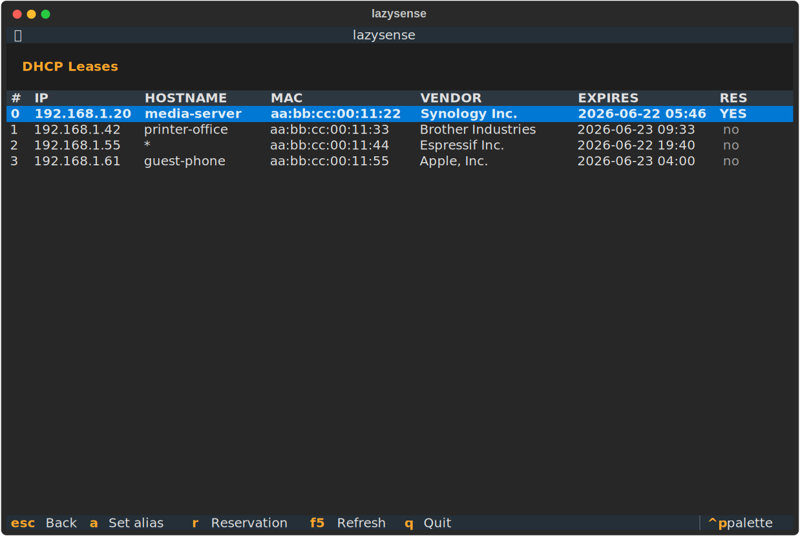
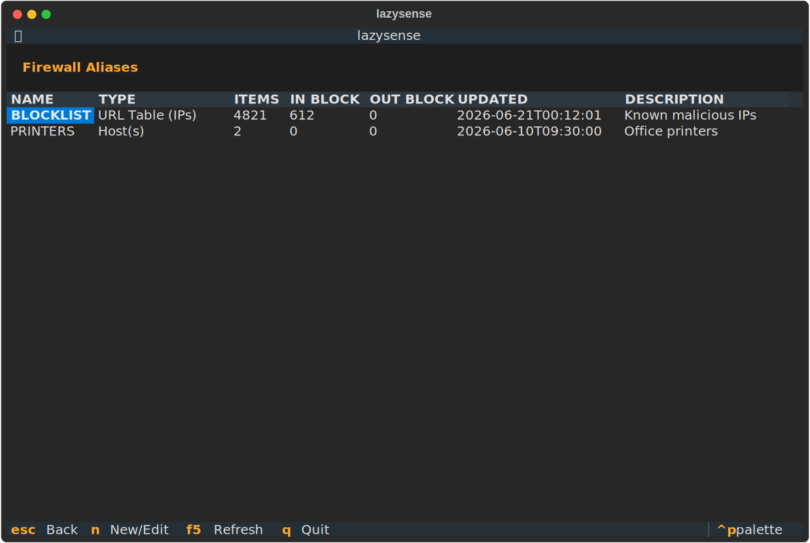

# lazysense 🦔

A small, portable Python tool for the OPNsense REST API. Run it with no
arguments for a colorful, navigable **Textual TUI**; run it with a subcommand
for a fast **non-interactive CLI** (scripting/cron-friendly).

```
./lazysense.py                              # opens the TUI
./lazysense.py dhcp-leases                  # direct CLI
./lazysense.py rules LAN in
./lazysense.py host-alias PRINTER_LAN 192.168.1.50
```

## Screenshots

| Main menu | Firewall rules (filtered) |
|---|---|
|  |  |

| DHCP leases | Aliases |
|---|---|
|  |  |

*(sample data, not a real network)*

## Features

- 🖥️ **TUI**: keyboard + mouse navigation, live filters on firewall rules
  (by interface and direction), scrollable tables, colorized actions/status,
  modal confirmations for anything that mutates state
- 🎨 **CLI**: readable colorized tables by default, `--json` for raw API output
- 🔌 **Self-installing**: first TUI launch creates a local `.venv/` and
  installs Textual automatically; the CLI path never touches it
- 🔥 Firewall rule listing/toggling, filterable by interface + direction
- 🏷️ Firewall alias management (host aliases, manual IP add/remove)
- 📡 DHCP lease browsing, indexed for quick reference by number
- 🌐 DNS/DHCP host + static reservation management (dnsmasq backend)
- 💾 Config backup download + listing, saved with `600` permissions
- 🧰 Raw `get`/`post` escape hatch for any other API endpoint

## Requirements

- Python 3.8+
- For the CLI: nothing else (stdlib only — `urllib`, `ssl`, `json`, `ipaddress`, `xml.etree`)
- For the TUI: [`textual`](https://github.com/Textualize/textual) — installed
  automatically into `.venv/` next to the script on first interactive launch
  (needs internet once; every later launch is instant)
- An OPNsense API key/secret (System → Access → Users → API keys)

## Install

```bash
git clone https://github.com/<you>/lazysense.git
cd lazysense
chmod +x lazysense.py
```

That's it — no `pip install` required up front. The script is fully portable:
copy the folder to any Linux box with `python3` and it works.

## Quick start

```bash
# Option A: environment variables
export OPNSENSE_HOST=192.168.1.1
export OPNSENSE_KEY=your_api_key
export OPNSENSE_SECRET=your_api_secret
./lazysense.py status

# Option B: credentials file (recommended)
mkdir -p ~/.opnsense
cat > ~/.opnsense/credentials <<'EOF'
OPNSENSE_HOST=192.168.1.1
OPNSENSE_PORT=443
OPNSENSE_KEY=your_api_key
OPNSENSE_SECRET=your_api_secret
OPNSENSE_INSECURE=true
EOF
chmod 600 ~/.opnsense/credentials
./lazysense.py status
```

By default `OPNSENSE_INSECURE=true` (skip TLS cert validation — typical for
a self-signed OPNsense web UI on a LAN). Pass `--secure` to enforce
validation, or set `OPNSENSE_INSECURE=false`.

## The TUI

```bash
./lazysense.py
```

Opens a full-screen menu: System status, Firewall rules, Aliases, DHCP
leases/reservations, Backups, and a raw API request screen.

- Arrow keys / mouse to navigate, `Enter` to select
- `Escape` to go back a screen
- Inside **Firewall rules**: type in the interface filter box and pick a
  direction from the dropdown — the table re-filters live
- `e` / `d` on a selected rule to enable/disable it (with confirmation)
- `a` on a selected DHCP lease to assign a hostname, `r` to turn it into a
  static reservation
- `n` on the Aliases screen to create/update a host alias

First launch creates `.venv/` next to the script and installs Textual into
it, then re-executes itself inside that venv. Every later launch reuses it
and starts instantly. If the script's own directory isn't writable, it falls
back to `~/.local/share/lazysense/venv`.

## CLI reference

```
Options:
    --insecure, -k                  Disable SSL certificate validation
    --secure                        Enable SSL certificate validation
    --json                          Print raw JSON instead of a formatted table

System:
    status                          System status
    firmware-status                 Firmware status
    interfaces                      Interface configuration
    version                          Show OPNsense version
    reboot                          Reboot system

Firewall:
    rules [if] [dir]                Show firewall rules, optionally filtered
                                     by interface(s) and/or direction(s)
    rule-enable <n>                 Enable rule by index (from rules)
    rule-disable <n>                Disable rule by index (from rules)
    firewall-stats                  Firewall pf statistics
    suricata-status                 Suricata IDS/IPS status

Aliases:
    aliases                         Show firewall aliases
    host-alias <name> <host> [desc] Create/update a firewall host alias from IP, DHCP index, MAC, or hostname
    alias-add-ip <name> <ip>        Add an IP to a manual alias
    alias-remove-ip <name> <ip>     Remove an IP from a manual alias

DHCP / DNS:
    dhcp-leases                     Show DHCP leases (indexed)
    dhcp-set-alias <n|ip> <name>    Set hostname/alias for a lease
    dhcp-set-reservation <n|ip>     Turn a dynamic lease into a static reservation
    reservations                    Show static DHCP reservations
    reservation-delete <n>          Delete a static reservation by index (from reservations)
    unbound-stats                   Unbound DNS statistics

Raw:
    get <endpoint>                  Raw GET request to endpoint
    post <endpoint> [data]          Raw POST request with JSON data

Backup:
    backup [dir] [backup_id]        Download latest/current config backup to dir
    backup-list                     Show available local config backups on OPNsense
```

### Examples

```bash
./lazysense.py rules                  # everything
./lazysense.py rules LAN              # only LAN interface
./lazysense.py rules LAN in           # LAN + inbound only
./lazysense.py rules LAN,WAN in,out   # comma-separated, multiple values
./lazysense.py rules "" out           # any interface, outbound only

./lazysense.py rule-disable 11        # toggle off, then "rules" again to confirm

./lazysense.py dhcp-leases
./lazysense.py host-alias PRINTER_LAN 192.168.1.50
./lazysense.py host-alias PRINTER_LAN 12               # by lease index
./lazysense.py host-alias PRINTER_LAN aa:bb:cc:dd:ee:ff # by MAC

./lazysense.py dhcp-leases                  # find its index, say 12
./lazysense.py dhcp-set-alias 12 printer    # gives it printer.<domain>
./lazysense.py dhcp-set-reservation 12      # pins IP+MAC as a static reservation
./lazysense.py reservations                 # confirm it's there

./lazysense.py backup-list
./lazysense.py backup ./backups
./lazysense.py backup ./backups config-1750433700.xml

./lazysense.py get /api/core/system/status
./lazysense.py post /api/firewall/filter/apply '{}'
./lazysense.py --json get /api/dnsmasq/settings/get

./lazysense.py help
./lazysense.py rules help
./lazysense.py dhcp-set-alias --help
```

## How resolution works

Most commands accept a "selector" for a host instead of a raw IP — an IP
address, a DHCP lease index (from a previous `dhcp-leases`/`rules` call,
cached in a temp file), a MAC address, or a hostname. lazysense resolves
whichever you give it against the live DHCP lease list and DNS/DHCP host
reservations.

## Project layout

```
lazysense.py           entry point: venv bootstrap + CLI/TUI dispatch
lazysense/
    api.py              OPNsense REST client, validation, high-level commands
    render.py            ANSI table/kv rendering for the CLI
    cli.py               argv parsing and command dispatch
    tui.py               Textual app, screens, modals
requirements.txt         textual (TUI only)
```

`api.py` is shared by both the CLI and the TUI — there is exactly one place
that talks to the OPNsense API.

## Security notes

- Credentials are read from environment variables or `~/.opnsense/credentials`
  (plain key=value, never executed/sourced as code) and are never printed or
  logged.
- Config backups downloaded with `backup`/`backup-list` contain your full
  OPNsense configuration (potentially including secrets) — they're saved
  with `600` permissions, but treat the output directory as sensitive.
- `OPNSENSE_INSECURE=true` (the default) skips TLS certificate validation.
  Fine for a LAN-only self-signed OPNsense UI; pass `--secure` if your
  OPNsense has a real certificate.

## License

MIT — see [LICENSE](LICENSE).
